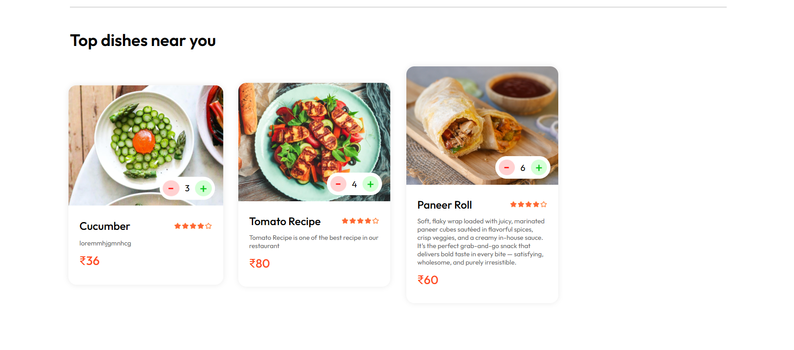
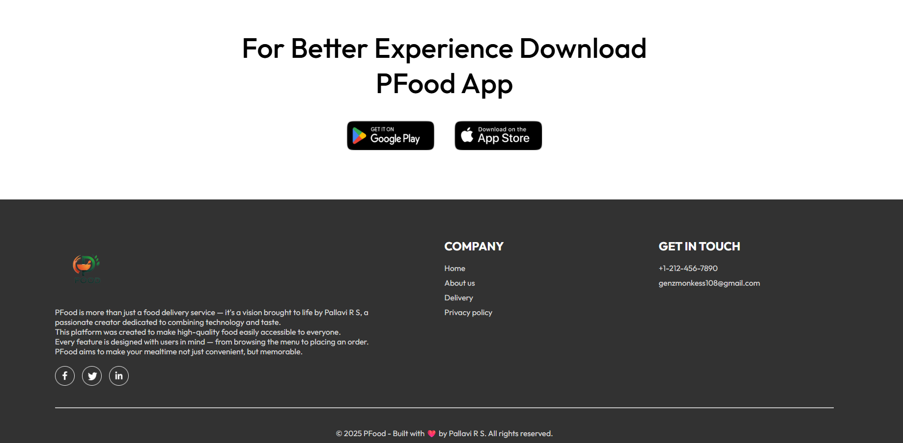

# 🍽️ PFood - A Full-Stack Food Ordering Web Application

**Built by Pallavi R S | 2025**

PFood is a fully responsive, end-to-end food ordering web application developed using the MERN stack (MongoDB, Express.js, React.js, Node.js) and integrated with the Stripe payment gateway. It provides a complete solution including customer-facing website, admin panel, and backend server.

This platform empowers users to register/login, explore a delicious menu, add items to cart, place online orders, and admin can manage food items and orders efficiently.

---

## 🌟 Features

- 🍔 Browse a dynamic food menu
- 🛒 Add to cart functionality
- 🔐 User authentication (signup & login)
- 💳 Stripe Payment Gateway Integration
- 📦 Order placement
- 👩‍💼 Admin panel for managing items & orders
- 🌍 Fully responsive and mobile-friendly UI

---

## 🚀 Tech Stack

| Layer      | Technology Used            |
| ---------- | -------------------------- |
| Frontend   | React.js + Vite            |
| Backend    | Node.js + Express.js       |
| Database   | MongoDB (Cloud with Atlas) |
| Auth       | JWT (JSON Web Token)       |
| Payments   | Stripe                     |
| Styling    | CSS / Flexbox              |
| Deployment | [Local / Production-ready] |

---

## 📸 Project Screenshots

### 🧢 Header


### 🛍️ Explore Menu


### 🥗 Top Dishes - Add to Cart



### 🛒 View Cart


### 📦 Place Order Form


### 📲 Mobile App Section



### 🧑‍💻 Admin Panel Dashboard


### 🍴 Add New Food Item


### ✅ Confirmation - Item Added


### 🧾 Orders List - Admin Panel


### 📃 My Orders (User View)


### 📄 List of Food Items


### 🔌 Backend Server Connection


---

## ⚙️ Installation & Setup Guide

> Referenced and simplified from [How To Run Project.pdf]

### 🔧 Pre-requisites

- Install [Node.js](https://nodejs.org/en/download/)
- Create a MongoDB Atlas account
- Have a Stripe account for payments

---

### 📁 Setup Backend

1. Open backend folder in VS Code
2. Open terminal → run:
   ```bash
   npm install
   ```
3. Setup MongoDB:

   - Create a cluster, database, and user
   - Whitelist your IP (0.0.0.0/0)
   - Get the connection string and paste it in `db.js`

4. Add your Stripe secret key in the `.env` file:

   ```
   STRIPE_SECRET_KEY=your_stripe_secret_key
   ```

5. Run the server:
   ```bash
   npm run server or npm start
   ```

---

### 💻 Setup Frontend & Admin Panel

1. Open frontend folder (React project) in VS Code
2. In terminal:
   ```bash
   npm install
   npm run dev
   ```
3. Your project will open in your browser on [http://localhost:5173](http://localhost:5173)

---

## 💡 Future Scope

- Push notifications for order updates
- WhatsApp integration for order status
- AI-based dish recommendations
- Admin analytics dashboard

---

## 👩‍💻 Developed By

> **Pallavi R S**  
> CSE Student | Fitness Enthusiast | Web Development Enthusiast  
> Bringing code + creativity into real-world impact 🚀

---

## 📄 License

This project is for learning and portfolio use.  
**© 2025 PFood by Pallavi R S — All Rights Reserved.**
